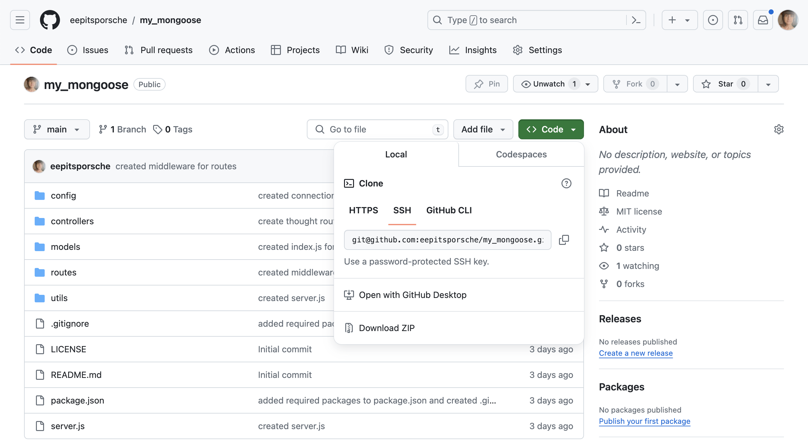

# My Mongoose


## Table of Contents

* [Description](#description)
* [Installation](#installation)
* [Usage](#usage)
* [Credits](#credits)
* [Technologies Used](#technologies-used)
* [License](#license)

## Description
My Mongoose serves as the back-end functionality of a full-stack social network app. Various API endpoints allow functions to create, modify, and delete users, user posts, and reactions to user posts through Express.js routing, a MongoDB database, and the Mongoose ODM.

Future development for this app could include functions to create a list of favorite thoughts wherein users may save and delete thoughts.


## Installation
[Clone the repository](https://github.com/eepitsporsche/my_mongoose) to your machine and open the application in VS Code.

Enter the command <code>npm init</code> into the VS Code terminal to install Node.

Enter <code>npm install</code> into the VS code terminal to install the required dependencies.

Install [MongoDB](https://www.mongodb.com/docs/v6.0/installation/) on your machine to operate database functionality of the My Mongoose app.

Install [Insomnia](https://insomnia.rest/download) on your machine to operate route functionality of the My Mongoose app.


## Usage

<p align="center"></p>

To initiate My Mongoose, enter the <code>npm start</code> command into the server.js terminal.

> [!IMPORTANT]
 Ensure you have installed all dependencies listed under [Installation](#installation) before initiating the program.

Open Insomnia to test and utilize the various route endpoints.

Endpoint options include:

```
* Users
    - GET all users /api/user
    - GET a user by ID /api/user/:userId
    - POST a new user /api/user
    - Put an update to a user by ID /api/user/:userId
    - DELETE a user /api/user/:userId
* Thoughts
    - GET all thoughts /api/thought
    - GET  a thought by ID /api/thought/:thoughtId
    - POST a new thought /api/thought
    - PUT an update to a thought /api/thought/:thoughtId
    - DELETE a thought /api/thought/:thoughtId
* Reactions
    - POST a reaction /api/thought/:thoughtId/reactions
    - DELETE a reaction /api/thought/:thoughtId/reactions/:reactionId
* Friends
    - POST a friend to friend list /api/user/:userId/friends/:friendId
    - DELETE a friend from friend list /api/user/:userId/friends/:friendId
```

> [Click here](https://drive.google.com/file/d/1VSVN0QxteYoafyKEjL3VY4dZ9iHaF0nO/view?usp=sharing) to view the video walk-through.


## Credits

* [Geeks for Geeks](https://www.geeksforgeeks.org/mongoose-schematype-options/)
* [mdn web docs_](https://developer.mozilla.org/en-US/docs/Learn/Server-side/Express_Nodejs/mongoose)
* [Akhil Anand on Medium](https://medium.com/@akhilanand.ak01/setup-a-basic-node-js-server-using-expressjs-mongoose-65f2a6dbfd58)
* [unblockMe YouTube Channel](https://www.youtube.com/watch?v=b8xUnZu4etU)
* UCB Bootcamp Instructor: [Robbert Wijtman](https://github.com/Bucky24)


## Technologies Used
* VS Code
* JavaScript
* Node.js
* Mongoose
* MongoDB
* Insomnia


## License
<a href="https://opensource.org/licenses/MIT">MIT License</a>

Copyright© 2024 Porsche Herskorn

Permission is hereby granted, free of charge, to any person obtaining a copy of this software and associated documentation files (the "Software"), to deal in the Software without restriction, including without limitation the rights to use, copy, modify, merge, publish, distribute, sublicense, and/or sell copies of the Software, and to permit persons to whom the Software is furnished to do so, subject to the following conditions:

The above copyright notice and this permission notice shall be included in all copies or substantial portions of the Software.

THE SOFTWARE IS PROVIDED "AS IS", WITHOUT WARRANTY OF ANY KIND, EXPRESS OR IMPLIED, INCLUDING BUT NOT LIMITED TO THE WARRANTIES OF MERCHANTABILITY, FITNESS FOR A PARTICULAR PURPOSE AND NONINFRINGEMENT. IN NO EVENT SHALL THE AUTHORS OR COPYRIGHT HOLDERS BE LIABLE FOR ANY CLAIM, DAMAGES OR OTHER LIABILITY, WHETHER IN AN ACTION OF CONTRACT, TORT OR OTHERWISE, ARISING FROM, OUT OF OR IN CONNECTION WITH THE SOFTWARE OR THE USE OR OTHER DEALINGS IN THE SOFTWARE.

### <p align="center">[Back to Top](#my-mongoose)</p>